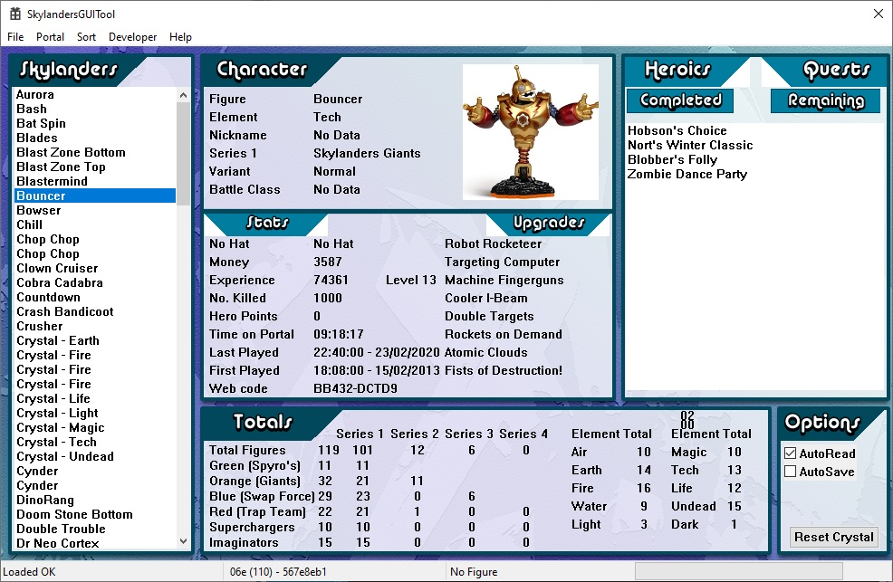

# Skylanders GUI Tool 4.2

### **DOWNLOAD: [Skylanders GUI Tool 4.2](https://github.com/skylandersNFC/Skylanders-GUI-Tool/releases/tag/4.2)**

### How To Use: **[How to Edit and Backup Skylanders](https://www.youtube.com/watch?v=DIgkSAm9yLk)**

# 

This is a backup of the "**Skylanders GUI Tool**" made by **Pyrofer**.

Source: https://www.pyrofersprojects.com/blog/skylanders-gui-tool/

---

For images place 150×150 24 bmp images of the figures in the xxImages folders.
The filename needs to be EXACTLY the same as the figure name shown in the app with .bmp on the end.

Lightcore figures go in lcImages. Any Spyro’s Adventure figures go in saImages etc.

lcImages – Lightcore figures
lgImages – Legendary figures
spImages – Special figures (gold/pumpkin/jade etc)
saImages – Spyro’s Adventure figures (Green Base)
sgImages – Skylanders Giants figures (Orange Base)
sfImages – Skylanders Swap Force figures (Blue Base)
ttImages – Skylanders Trap Team figures (Red Base)
scImages – Skylanders Superchargers (Engine base/vehicles)
imImages – Skylanders Imaginators (Senseis and Crystals)

If you have a valid keyfile it should be called example.key and placed in the root with the main .exe file, if you don’t have one you can create it from within the app by entering the correct values in the text entry box and hitting “make key”.

Features that don’t work without a key file will not appear if the key is not valid, thus the app will seem pretty empty. This is not a bug.
Only when the keyfile is correct will the app open fully with all features shown.

If you have “autoread” selected any figure placed on the portal will automatically be read and displayed.
If you have “autosave” selected any read figure will also be automatically saved into the db.

If the database does not exist it will be created and saved when you exit. Database saving is automatic on exit of the app.

figure dumps are saved in “dumps” and identified by their UID.

To load a figure from the DB simply double click them in the database list on the left, to save them you can select save from the file menus.
You can also load and DELETE figures from the database in the file menu.

The import figure menu loads a file saved into the app for viewing and/or saving into your database but it can come from any source (you can view friends figure dumps. This file should be called “import.dmp” and put in the main root with the .exe file.

Portal Menu,
The portal menu has “connect”, the app should automatically connect to the portal but if you are having trouble you could try reconnecting.
You can also read and write figures on the portal from this menu if autoread isn’t selected.

Sort Menu,
This lets you sort the data shown in the figure list on the left making it easier to find a figure if you have a large collection.

Updates

Feel free to report bugs! If you notice something doesn’t show up right, please detail which figure it is, what shows up wrong and note the figure ID (the number in brackets at the status bar in the bottom, just after the text saying “Figure Read OK”). You can also pick “Raw Dump” from the developer menu and include that 1k file if you want to.

Updates 4.2 – 6/4/20
Added in Superchargers and Imaginators in the database stats
More fixes for figure stats detection
Added in XP and levels above 20 for Imaginators

Updates 4.1 – 6/4/20
Added in Battle Class detection
Fixed Some other stat detection

Updates 4.0.1 – 4/4/20
Updated Crystal detection
Updated Sensei detection

Updates 4.0 – 1/4/20
It now mostly supports Superchargers and Imaginators.
There are still some bugs with data entry regarding types and elements
